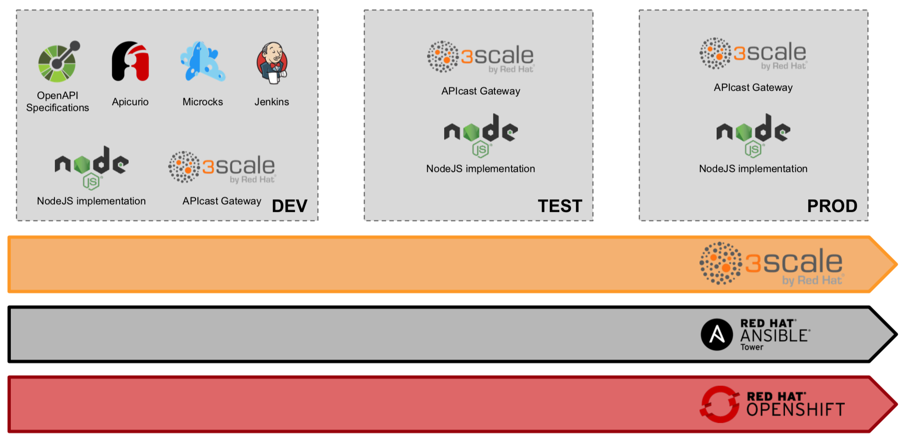

# RHTE API Lifecycle Demo

This repository contains all the artefacts to deliver an *API Lifecycle Demo*:
from the OpenAPI Specifications to the production in 20 minutes.

## Requirements

To setup and deliver this demo, you will need:

- an OpenShift cluster with sufficient RAM (**4GB free**), CPU (**2 vCPU**),
  and storage (a few Persistent Volumes for a total storage requirements of
  **1-2 GB**), publicly accessible on the Internet.
- a GitHub, GitLab or Bitbucket account.
- an account on [apicur.io](https://studio.apicur.io/).
- a 3scale SaaS Tenant (you can also use an on-premise tenant with minor changes)

Note: you can deliver this demo fully on-premise by if needed but you will
need to deploy also:

- a GIT repository (hint: [Gitea](https://gitea.io/))
- the 3scale API Management Platform
- the Apicurio Studio

## Setup

### 1/ Fork this repository

Fork this repository using your GitHub account or on any other GIT provider (GitLab, BitBucket, etc.).

### 2/ Create the OpenShift projects

```sh
oc new-project rhte-build --display-name="RHTE API (BUILD)"
oc new-project rhte-test --display-name="RHTE API (TEST)"
oc new-project rhte-prod --display-name="RHTE API (PROD)"
oc new-project ansible --display-name="Ansible Tower"
```

### 3/ Deploy Microcks in the BUILD environment

```sh
oc create -f https://raw.githubusercontent.com/microcks/microcks/master/install/openshift/openshift-persistent-full-template.yml -n rhte-build
```

The command below should be run by a cluster administrator because it requires to create an OAuthClient in OpenShift. In the command below, replace the variables by your values:

- `<project>` : name of project where setup is done. Here `rhte-build`.
- `<master_url>` : the HTTPS URL of OpenShift master
- `<app_host_url>` : the Host for Routes, ex `192.168.99.100.nip.io` when using CDK or Minishift.

```sh
oc new-app -n rhte-build --template=microcks-persistent --param=APP_ROUTE_HOSTNAME=microcks-<project>.<app_host_url> --param=KEYCLOAK_ROUTE_HOSTNAME=keycloak-<project>.<app_host_url> --param=OPENSHIFT_MASTER=<master_url> --param=OPENSHIFT_OAUTH_CLIENT_NAME=<project>-client
```

Create a Jenkins Master image containing Microcks plugin.

```sh
oc process -f https://raw.githubusercontent.com/microcks/microcks-jenkins-plugin/master/openshift-jenkins-master-bc.yml | oc create -f - -n rhte-build
```

Wait for build to finish.

### 4/ Deploy Jenkins in the BUILD environment

```sh
oc new-app -n rhte-build --name=jenkins  --template=jenkins-persistent --param=NAMESPACE=rhte-build --param=JENKINS_IMAGE_STREAM_TAG=microcks-jenkins-master:latest -p MEMORY_LIMIT=2Gi
oc env -n rhte-build dc/jenkins JENKINS_OPTS=--sessionTimeout=86400
```

### 5/ Give Jenkins the right to manage the TEST and PROD environments

```sh
oc adm policy add-role-to-user admin system:serviceaccount:rhte-build:jenkins -n rhte-test
oc adm policy add-role-to-user admin system:serviceaccount:rhte-build:jenkins -n rhte-prod
```

### 6/ Build the API Backend

Create a new BuildConfig to build the API Backend using your forked repository.
Do not forget to replace `https://github.com/nmasse-itix/rhte-api.git` by your
repository URL.

```sh
oc new-build -n rhte-build nodejs:8~https://github.com/nmasse-itix/rhte-api.git --strategy=source --name=rhte-api
oc start-build -n rhte-build rhte-api
```

Wait for the build to finish:

```sh
oc logs -f bc/rhte-api -n rhte-build
```

### 7/ Deploy the API Backend to the TEST and PROD environments

```sh
oc tag rhte-build/rhte-api:latest rhte-api:ready-for-test -n rhte-test
oc new-app rhte-api:ready-for-test --name rhte-api -n rhte-test
oc expose svc/rhte-api -n rhte-test
oc tag rhte-build/rhte-api:latest rhte-api:ready-for-prod -n rhte-prod
oc new-app rhte-api:ready-for-prod --name rhte-api -n rhte-prod
oc expose svc/rhte-api -n rhte-prod
```

### 8/ Remove the trigger on the TEST and PROD environments

```sh
oc set triggers dc/rhte-api --from-image=rhte-api:ready-for-test --manual=true -c rhte-api -n rhte-test
oc set triggers dc/rhte-api --from-image=rhte-api:ready-for-prod --manual=true -c rhte-api -n rhte-prod
```

### 9/ Prepare your 3scale SaaS Tenant

Create an Access Token in your 3scale SaaS Tenant that has read-write access to the Account Management API. Please check [3scale documentation](https://access.redhat.com/documentation/en-us/red_hat_3scale/2-saas/html-single/accounts/index#access_tokens) on how to get an access token. Write down this value for later use.

You will also need the name of your 3scale tenant.

On your 3scale Admin Portal, go the `Developer Portal` section and replace your standard `Documentation` page by [the content of 3scale-docs.html](3scale-docs.html).

**Do not forget to hit `Save` and `Publish`.**

### 10/ Deploy the 3scale APIcast instances in TEST and PROD

```sh
oc process -f apicast-template.yaml -p ACCESS_TOKEN=<YOUR_3SCALE_ACCESS_TOKEN> -p TENANT=<YOUR_3SCALE_TENANT> |oc create -f - -n rhte-test
oc process -f apicast-template.yaml -p ACCESS_TOKEN=<YOUR_3SCALE_ACCESS_TOKEN> -p TENANT=<YOUR_3SCALE_TENANT> |oc create -f - -n rhte-prod
```

### 11/ Create the OpenShift routes for your APIcast gateways

```sh
oc process -f apicast-routes-template.yaml -p MAJOR_VERSION=1 -p WILDCARD_DOMAIN=test.app.itix.fr | oc create -f - -n rhte-test
oc process -f apicast-routes-template.yaml -p MAJOR_VERSION=2 -p WILDCARD_DOMAIN=test.app.itix.fr | oc create -f - -n rhte-test
oc process -f apicast-routes-template.yaml -p MAJOR_VERSION=1 -p WILDCARD_DOMAIN=prod.app.itix.fr | oc create -f - -n rhte-prod
oc process -f apicast-routes-template.yaml -p MAJOR_VERSION=2 -p WILDCARD_DOMAIN=prod.app.itix.fr | oc create -f - -n rhte-prod
```

### 12/ Deploy Ansible Tower

```sh
oc project ansible
oc apply -f - <<EOF
apiVersion: "v1"
kind: "PersistentVolumeClaim"
metadata:
  name: "postgresql"
spec:
  accessModes:
    - "ReadWriteOnce"
  resources:
    requests:
      storage: "5Gi"
EOF
```

> Note: since AWX moves very fast, it is recommended to settle the version of all components.

```sh
git clone https://github.com/ansible/awx.git
git clone https://github.com/ansible/awx-logos.git
cd awx
git checkout 2b9954c .
cd installer
ansible-playbook -i inventory install.yml -e kubernetes_web_version=1.0.7.2 -e kubernetes_web_version=1.0.7.2 -e kubernetes_memcached_image=1.5.10 -e openshift_host="$(oc whoami --show-server)" -e openshift_skip_tls_verify=true -e openshift_project="$(oc project -q)" -e openshift_user="$(oc whoami)" -e openshift_token="$(oc whoami -t)" -e admin_user=admin -e admin_password=redhat123 -e awx_official=true
```

The default installation of AWX uses a combination of `latest` tags and an `imagePullPolicy` set to `always`, which is a recipe for disaster. All tags have been set explicitely on the command line earlier, now you can set the `imagePullPolicy` to `IfNotPresent`.

```sh
oc patch dc/awx --type=json -p '[ { "op": "replace", "path": "/spec/template/spec/containers/0/imagePullPolicy", "value": "IfNotPresent" }, { "op": "replace", "path": "/spec/template/spec/containers/1/imagePullPolicy", "value": "IfNotPresent" }, { "op": "replace", "path": "/spec/template/spec/containers/2/imagePullPolicy", "value": "IfNotPresent" }, { "op": "replace", "path": "/spec/template/spec/containers/3/imagePullPolicy", "value": "IfNotPresent" } ]'
```

### 13/ Configure project and job in AWX

Login on AWX as admin, go to the *Projects* section and add a new project with following properties :

* Name: `Deploy API to 3scale`
* Description: `Enable continuous deployment of an API to 3scale AMP`
* Organization: `default`
* SCM Type: `Git`
* SCM URL: `https://github.com/nmasse-itix/threescale-cicd-awx`
* SCM Branch/Tag/Commit: `master`

You can also tick `Update Revision on Launch` and setup a cache timeout.

Then you have to add a new *Job Template* with following properties :

* Name: `Deploy an API to 3scale`
* Project: `Deploy API to 3scale`
* Playbook: `deploy-api.yml`
* Inventory: `Prompt on Launch`
* Extra-variables: `Prompt on Launch`

For both the TEST and PROD environments, you will have to declare an inventory into AWX.

* Create an inventory named `3scale-test` and set the `Variables` field to:

```yaml
---
ansible_connection: local
```

* Save
* Move to the `Groups` section and create a group named `threescale`
* Set the `Variables` field to:

```yaml
---
threescale_cicd_access_token: <3scale_access_token>
threescale_cicd_api_environment_name: test
threescale_cicd_wildcard_domain: test.app.itix.fr
```

* Do not forget to replace the `threescale_cicd_access_token`, `threescale_cicd_api_environment_name` and `threescale_cicd_wildcard_domain` variables with respectively your access token to 3scale API Management backend, the name of environment as well as the wildcard that will be used to serve Gateway through Route.

* Move to the `Hosts` section
* Add a host that matches your 3scale Admin Portal (`<TENANT>-admin.3scale.net`). For example: `nmasse-redhat-admin.3scale.net`

* Duplicate this inventory and change the `threescale` group variables to:

```yaml
---
threescale_cicd_access_token: <3scale_access_token>
threescale_cicd_api_environment_name: prod
threescale_cicd_wildcard_domain: prod.app.itix.fr
```

* Change the name of the new inventory to `3scale-prod` and save

### 14/ Create the Jenkins Pipeline

Create the Jenkins pipeline from your forked repository:

```sh
oc process -f pipeline-template.yaml -p GIT_REPO=https://github.com/nmasse-itix/rhte-api.git -p MICROCKS_TEST_ENDPOINT=http://$(oc get route rhte-api -n rhte-test -o jsonpath={.spec.host}) |oc create -f - -n rhte-build
```

## 15/ Jenkins setup for Ansible Tower

You finally need to configure the connection between Jenkins and AWX/Ansible Tower. To do this, go to Jenkins, click on *Manage Jenkins* > *Manage Plugins* and install the `Ansible Tower` plugin. You do not need to restart Jenkins.

Then click on *Credentials* > *System*, click on *Global credentials (unrestricted)* and select *Add Credentials...* to add a new user for connection to AWX/Ansible Tower. Fill-in your AWX/Tower Admin login and password, and choose `tower-admin` for the id field.

Finally, you also have to configure an alias to your AWX Server into Jenkins. This will allow our Jenkins pipelines to access the AWX server easily without knowing the complete server name or address. Click on *Configure System* in the management section and then go to the *Ansible Tower* section and add a new Tower Installation. Give it a name (we've simply used `tower` in our scripts), fill the URL and specify that it should be accessed using the user and credentials we have just created before.

## 16/ Load the OpenAPI Specifications to Apicurio

Go to [studio.apicur.io](https://studio.apicur.io/), login and import the three API contracts in the [api-contract](api-contract) folder.

* Go to [https://studio.apicur.io/apis/import](https://studio.apicur.io/apis/import)
* Choose `Import from URL`
* Fill-in the URL field with the raw url of the first API Contract (https://raw.githubusercontent.com/nmasse-itix/rhte-api/master/api-contracts/openapi-spec-v1.0.yaml)
* Repeat the process with the two remaining API contracts

## Running the Demo

_Welcome everybody ! We will spend twenty minutes together on a demo of 3scale._

_In this demo we will explore together a practice that is more and more used on customer site: Agile API Development._

_Here are the components that we will use in this demo. We will create an OpenAPI Specification using Apicurio. We will expose a mock of this API using Microcks. We will use Jenkins to deploy our first NodeJS implementation._



_This will be our DEV environment. Of course, there will be other environments: a TEST environment and a PROD environment._

_To deploy this setup, we will use OpenShift. To automate the delivery of our API between environments we will use Ansible Tower. To expose and manage our API, we will use, of course, 3scale._

_In this setup, we will develop and deploy an API that gives information about the Red Hat Tech Exchange. Quite relevant, isn’t it ?_

_There are two methods:_

- _`GetLocation` to know the location of the next Tech Exchange_
- _`GetTimeframe` to know when the next Tech Exchange takes place_

_A first version, a v1.0, is already deployed._

- Open your 3scale Developer Portal
- Go to `Documentation` and show the RHTE-API service flagged as v1.0

_Together, we have been tasked to craft, develop and deploy a v1.1 that provides an additional method `GetParticipants` so that we can know who will attend the next Tech Exchange._

_And because strong security is at stake, we will upgrade the current API from an API Key scheme to the more secure protocol “OpenID Connect”. This will be our V2._

_Let’s start our duty with Apicurio. In Apicurio we will create the GetParticipants method and bump the version number so that everyone can know a new version has been released._

- Open the [Apicurio Studio](https://studio.apicur.io/), go to `APIs` > `View all APIs` and select the `RHTE API 1.0`.
- Click `Edit API`
- Change the version number to `1.1.0`
- Add a path `/participants`
- Add the `GET` method under `/participants`
- Define a name, description and operation id for this method
- Add a `200` response code with a description ("OK")
- Go back to the `RHTE API` summary and click the three dots
- Click `Publish`, choose `GitHub`
- Select your organisation, find your forked repository named `rhte-api`, select the branch `master`
- In the resource field, put `openapi-spec.yaml`
- Give a commit message and click `Publish API`

_Then, we need to define some examples for this new method. Here I used Postman to define an example: Manfred and myself are attending the Tech Exchange. Then, those examples are used to generate a mock that can be used internally or by partners to develop their clients using our new API._

- Import the [postman_collection.json](postman_collection.json) file in Postman
- Show the defined examples
- Unfold the `Get participants` method and open the included example

_The GetParticipants method needs to return a list of participants._

- Open your Microcks instance
- Go to the services list and open the `RHTE-API` service
- Show the `GetParticipants` method
- Call it from a curl command:

```sh
curl -D - http://microcks-rhte.app.itix.fr/rest/RHTE-API/1.1/participants
```

_In the meantime, we can start our implementation. Let’s develop some code for our new API Method._

- In GitHub, open the [server.js](server.js) file

_Ok, now we need to implement our new `GetParticipants` method. Let's do it !_

- Uncomment the `router.get("/participants" ...` lines.
- Save the file

_Now, we have to deploy our new API: the v1.1 that contains the new method. For this, we need to deploy our new code to the three OpenShift environments but also to the 3scale environments._

_We will use Jenkins that will do the Continuous Integration and Ansible for the Continuous Deployment._

- Go to your OpenShift build project
- Go to `Build` > `Pipelines`
- Click on the `rhte-pipeline`
- Click `Start Pipeline`

_Let’s trigger a new deployment !_

_While the deployment is running, let’s have a look at the Jenkins pipeline. In the first step, we checkout the source code, then we run unit tests. We then ask OpenShift to build the container image for us and tag it. Once built, the image is tagged “ready for dev” and deployed in the DEV environment. Jenkins triggers a new Job in Ansible that will takes care of the API Deployment in 3scale. And so on in the next environments._

_Did you noticed the step called `Run integration tests`? The Jenkins pipeline is calling Microcks to ensure that the deployed service is compliant with the OpenAPI Specifications and business expectations._

- In Postman, unfold the `GetParticipants` method
- Click the `Tests` tab and show the included test

_For the `GetParticipants` method, we defined a test that ensures the API always returns exactly two participants._

- Show the included tests for the other methods
- Go to the Microcks interface, go to `Services`
- Open the `RHTE-API` service
- Show the latest test, exhibit the response times and payload.

_In the meantime, our API has been deployed at least in the DEV environment. Let see how it looks._

- Open your 3scale Developer Portal
- Login with the built-in `john` user account
- Go to `Applications` and find the smoke test application for the production environment
- Copy the API Key
- Go to `Documentation`, choose the `RHTE API (PROD, v1.1)` service
- Click on the red exclamation mark
- Fill-in your API Key
- Validate
- Try a call to `GetParticipants`

_Ok, our v1.1 is deployed. Job done. Now, let’s deploy the V2._

_The V2 will be based on v1.1 but will use OpenID Connect instead of API Keys._

_As a developer, if I need to use OpenID Connect, I only need to know one thing: how to define it in the OpenID Specification. Let me show you._

- Open the [Apicurio Studio](https://studio.apicur.io/), go to `APIs` > `View all APIs` and select the `RHTE API 1.0`.
- Click `Edit API` and show the security definitions and security constraints

_In the OpenID Specification, this part states that we require an API Key to use this API. Let’s replace it with this and now we are stating we want an OpenID Connect token instead._

- Go to `APIs` > `View all APIs` and this time select the `RHTE API 2.0`.
- Click `Edit API` and show the security definitions and security constraints

_Since it is a breaking change of the API Contract, do not forget to change the API Version to 2.0._

- Show the version number
- Go back to the `RHTE API` summary and click the three dots
- Click `Publish`, choose `GitHub`
- Select your organisation, find your forked repository named `rhte-api`, select the branch `master`
- In the resource field, put `openapi-spec.yaml`
- Give a commit message and click `Publish API`

_Let’s trigger the deployment of this V2._

_While it’s running, let’s summarize what we learned so far:_

- _Apicurio is used to define the API Contract between the provider and the consumer_
- _Microcks is used to define a mock of the API that can be used by consumers to develop their clients without having to wait for our implementation_
- _We developed our new API and pushed it to production using Jenkins and Ansible in an automated way._
- _We showed how we can have API versioning in 3scale: minor versions can be pushed continuously, major versions can be deployed side-by-side._
- _Last but not least, using OpenID Connect is just a matter of choosing it in the OpenAPI Specifications. As a developer, this is the only thing I have to remember. The deployment pipeline is doing the hard job of configuring everything for me._

_If you liked this demo, please have a look at this serie of three articles that have been published on the Red Hat Developer Blog that present in great details the Agile API Development process:_

- [An API Journey: From Idea to Deployment the Agile Way – Part I](https://developers.redhat.com/blog/2018/04/11/api-journey-idea-deployment-agile-part1/)
- [An API Journey: From Idea to Deployment the Agile Way – Part II](https://developers.redhat.com/blog/2018/04/19/api-journey-idea-deployment-agile-way-part2/)
- [An API Journey: From Idea to Deployment the Agile Way – Part III](https://developers.redhat.com/blog/2018/04/26/api-journey-idea-deployment-agile-way-part3/)

## Reset the Demo

- Open the [Apicurio Studio](https://studio.apicur.io/), go to `APIs` > `View all APIs` and select the `RHTE API 1.0`.
- Set the version back to `1.0`
- Remove the path `/participants`
- Publish the API to your GitHub repository

- Go to your 3scale admin portal and delete the four services (RHTE 1.1 TEST, RHTE 1.1 PROD, RHTE 2.0 TEST, RHTE 2.0 PROD)
- Also delete the four ActiveDocs

- In GitHub, open the [server.js](server.js) file and comment the `router.get("/participants" ...` lines.
- Save the file
